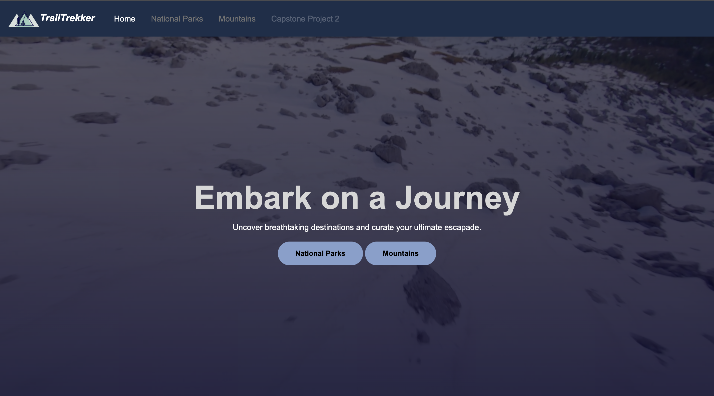
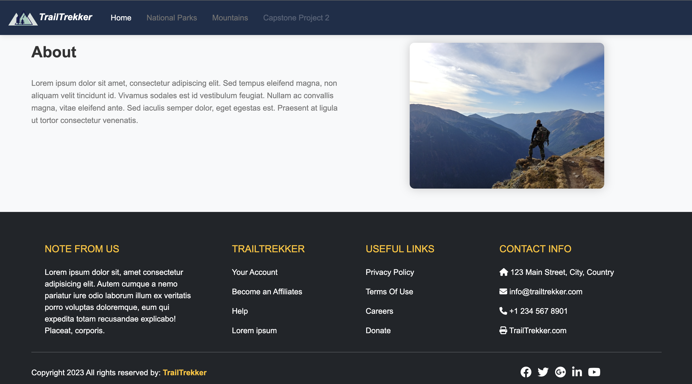
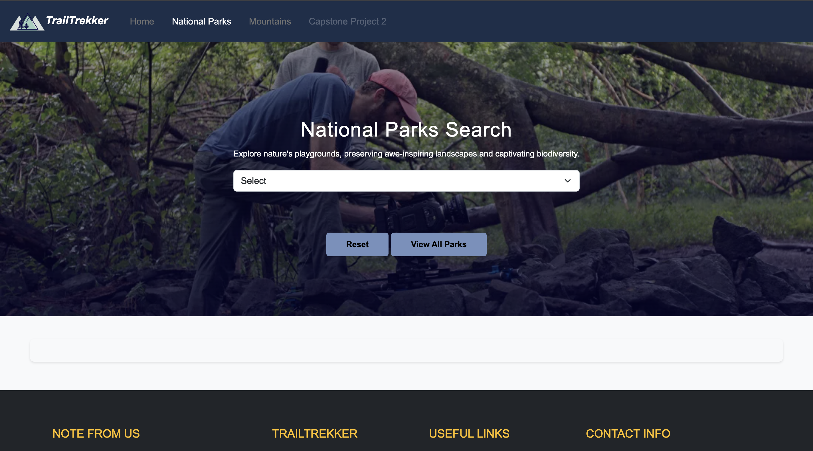
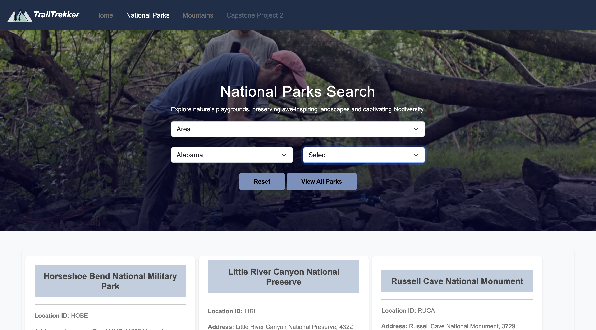
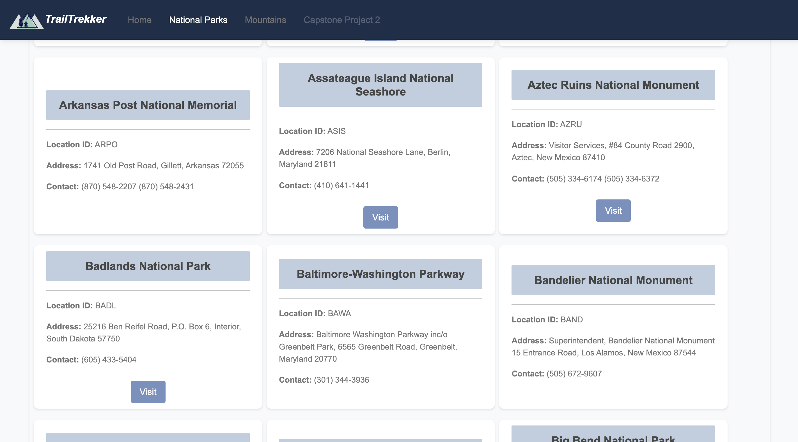
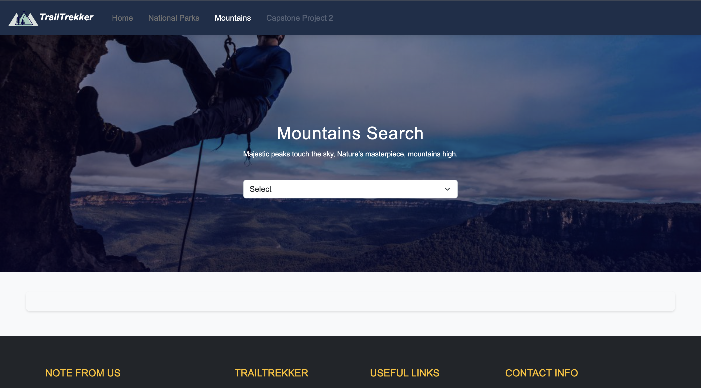
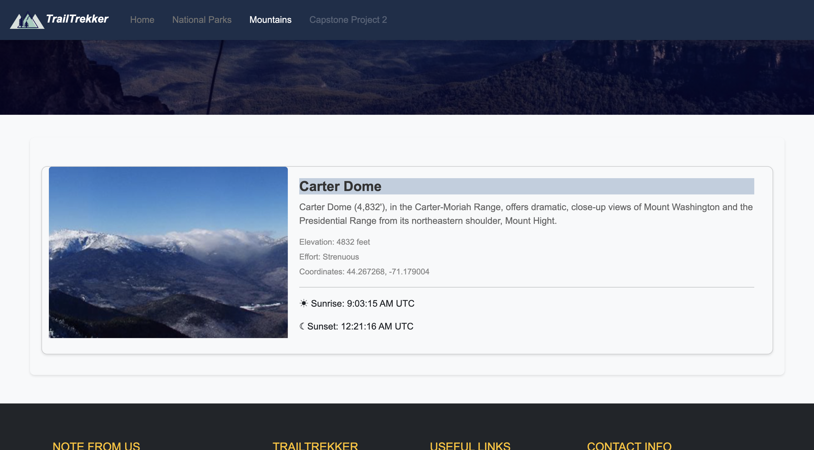
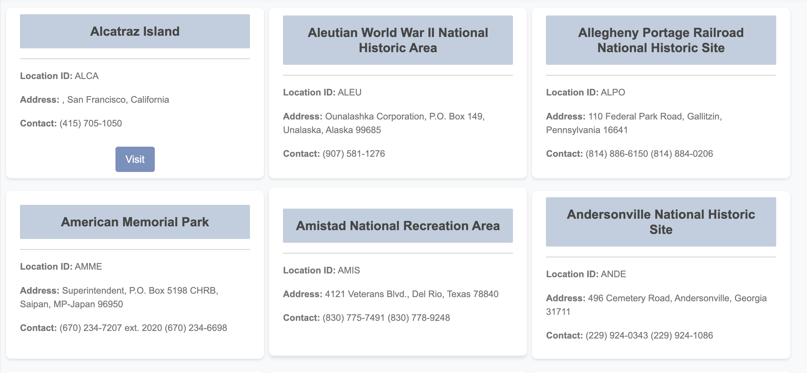

## 2nd Capstone project
# TrailTrekker


 
## About the project >
Welcome to TrailTrekker, an exciting and user-friendly outdoor website designed to enhance your exploration of parks and mountains. Whether you're an avid hiker, nature enthusiast, or simply looking to spend quality time in the great outdoors, TrailTrekker is here to provide you with the information you need to make the most of your adventures.

With TrailTrekker, searching for parks and mountains is a breeze. Our intuitive search functionality allows you to easily find your desired destination. Whether you're interested in discovering a picturesque national park or conquering a majestic mountain peak, TrailTrekker has got you covered.

## Built With >
* HTML
* CSS
* JS
* Bootstrap

## pages features >
* Landing Page - The main page features a top navigation bar and a captivating hero section with a looping video and text overlay with two buttons that would lead you to our National park, or mountain page. Below that, you'll find a concise "About Us" section, followed by a footer with important links. It's a sleek and engaging design that ensures easy navigation and provides essential information.

* National Park - On the National Park page, we maintain a consistent design with the navigation bar and footer, ensuring a seamless experience throughout the website. The hero section features a picture of a park with a selection bar and two buttons: "View All Parks" and "Reset." As you navigate, the selection bar dynamically updates, and the relevant parks appear below based on your selection. If available, a link to the park's main site is provided for further exploration.

* Mountains -On the Mountains page, you'll find the familiar navigation bar and footer for consistency. The hero section, similar to the National Park page, showcases a captivating layout. However, instead of multiple selection options, you'll encounter a single selection bar, eliminating the need for buttons. As you make your selection, the search result will showcase a single outcome, tailored to your choice. This streamlined approach ensures a focused and efficient experience when exploring mountains. One unique feature is its real-time data integration for sunrise and sunset times. Using live data sources, it provides up-to-date information, allowing you to plan activities and capture beautiful moments in the golden hour. 

## Interesting concepts
1. Mountain Card

**HTML CODE**

  ```html
<section class="parks-info-section">
 <div class="container">
          <div id="displayMountainInfo" class="row"></div>
        </div>
      </section>

  ```

**CSS CODE**
  ```css
.mountain-card {
  background-color: #f8f9fa;
  border-radius: 10px;
  box-shadow: 0 2px 4px rgba(0, 0, 0, 0.1);
  overflow: hidden;
  transition: transform 0.3s ease;
  margin-top: 30px;
  margin-bottom: 30px;
}

.mountain-card:hover {
  transform: translateY(-5px);
}

.mountain-image {
  height: 300px;
  object-fit: cover;
}

.mountain-title {
  color: #333;
  font-size: 24px;
  font-weight: bold;
  margin-bottom: 10px;
  background-color: #bfcedf;
}

.mountain-description {
  color: #666;
  font-size: 16px;
  margin-bottom: 15px;
}

.mountain-info {
  color: #888;
  font-size: 14px;
  margin-bottom: 5px;
}

.card-body {
  padding: 20px;
}
  ```

**JS CODE**
```js
function generateMountainCard() {
  const selectedMountainElement = listOfMountain.value;
  const mountain = mountainsArray.find((obj) => obj.name === selectedMountainElement);

  mountainInfoSection.innerHTML = `
    <div class="card mb-3 mountain-card">
      <div class="row g-0">
        <div class="col-md-4">
          
        </div>
        <div class="col-md-8">
          <div class="card-body">
            <h5 class="card-title mountain-title">${mountain.name}</h5>
            <p class="card-text mountain-description">${mountain.desc}</p>
            <p class="card-text mountain-info">Elevation: ${mountain.elevation} feet</p>
            <p class="card-text mountain-info">Effort: ${mountain.effort}</p>
            <p class="card-text mountain-info">Coordinates: ${mountain.coords.lat}, ${mountain.coords.lng}</p>
            <hr/>
            <p><i class="bi bi-sunrise"></i> &#x2600; Sunrise: <span id="sunriseTime"></span> UTC</p>
            <p><i class="bi bi-sunset-fill"></i> &#x263E; Sunset: <span id="sunsetTime"></span> UTC</p>
          </div>
        </div>
      </div>
    </div>`;

  const sunriseTimeElement = document.querySelector("#sunriseTime");
  const sunsetTimeElement = document.querySelector("#sunsetTime");

  fetchSunriseSunsetTime(mountain.coords.lat, mountain.coords.lng)
    .then((data) => {
      sunriseTimeElement.textContent = data.results.sunrise;
      sunsetTimeElement.textContent = data.results.sunset;
    });
}
```
# Screenshots of website










